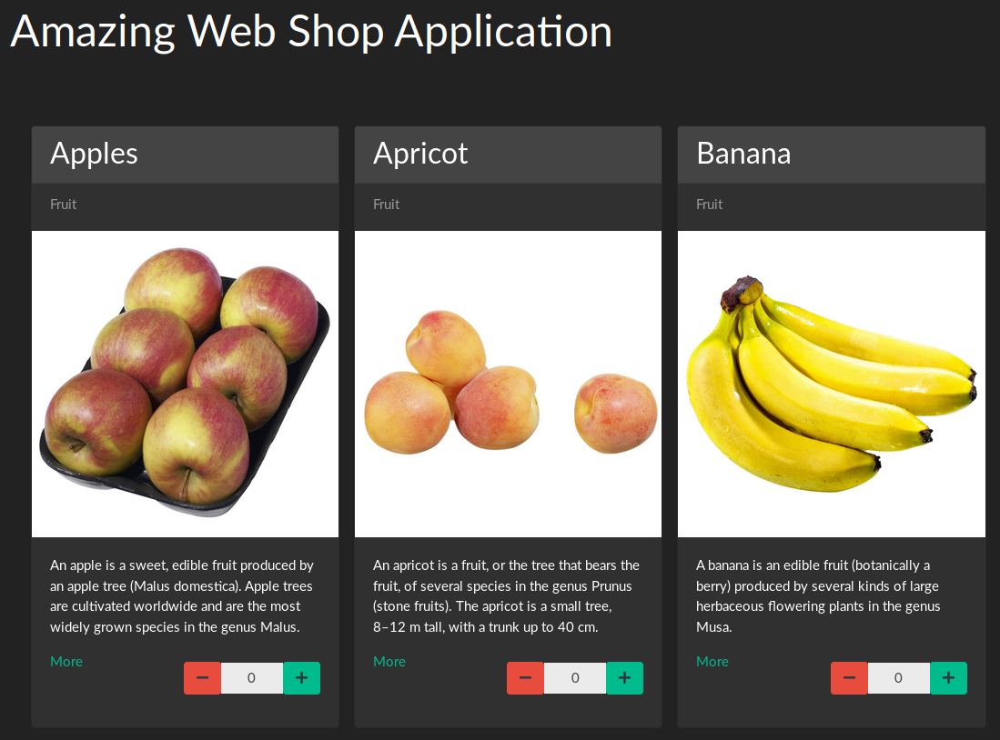

# WebShop Application with Component

This backend provides a small web-application consisting of a [pedestal](http://pedestal.io/)
service, and a database connection to persist items. These two components are compose in 
a system with Stuart Sierra's [Component](https://github.com/stuartsierra/component) 
library. The repo is based on [n2o's ToDo app](https://github.com/n2o/component-todo-app).

## Requirements

Short and crisp: Always have [Docker](https://docs.docker.com/install/) installed.

Do you want to run the app virtualized with docker?
* Yes: Then you will need [Docker Compose](https://docs.docker.com/compose/install/).
* No: Please have [Leiningen](https://leiningen.org/#install) installed as build tool.

## Setup

The app needs a postgres database. You can create a database with correct
settings via (pls skip this step if you got docker):

    docker run --rm \
        -e POSTGRES_PASSWORD=clojure \
        -e POSTGRES_USER=clojure \
        -e POSTGRES_DB=clojure \
        -p 5432:5432 \
        postgres:12-alpine

Then you can start the system:

    lein run

The service is reachable via http://localhost:8080, and the swagger file is on http://localhost:8080/swagger.

### No Clojure/Leiningen installed?

No problem, please use:

    docker-compose up

### Tests

There are sample tests, which can be run with

    lein test

### Helper

You can run multiple helping tools like code formatting, linting, interactive 
dependency checker and code analyzer via:

    lein cljfmt fix
    lein eastwood
    lein ancient upgrade :interactive
    lein kibit

## Demo

## License
___
*All images are under the copyright of [METRO AG](https://www.metroag.de/).*
___

The MIT License (MIT)

*Copyright © 2021 Dr. Tobias Schröder*

Permission is hereby granted, free of charge, to any person obtaining a copy of
this software and associated documentation files (the "Software"), to deal in
the Software without restriction, including without limitation the rights to
use, copy, modify, merge, publish, distribute, sublicense, and/or sell copies of
the Software, and to permit persons to whom the Software is furnished to do so,
subject to the following conditions:

The above copyright notice and this permission notice shall be included in all
copies or substantial portions of the Software.

THE SOFTWARE IS PROVIDED "AS IS", WITHOUT WARRANTY OF ANY KIND, EXPRESS OR
IMPLIED, INCLUDING BUT NOT LIMITED TO THE WARRANTIES OF MERCHANTABILITY, FITNESS
FOR A PARTICULAR PURPOSE AND NON INFRINGEMENT. IN NO EVENT SHALL THE AUTHORS OR
COPYRIGHT HOLDERS BE LIABLE FOR ANY CLAIM, DAMAGES OR OTHER LIABILITY, WHETHER
IN AN ACTION OF CONTRACT, TORT OR OTHERWISE, ARISING FROM, OUT OF OR IN
CONNECTION WITH THE SOFTWARE OR THE USE OR OTHER DEALINGS IN THE SOFTWARE.
